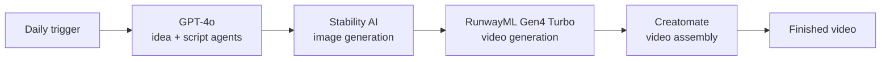

# Multi-Model AI Content Pipeline (n8n)

An automated, end-to-end pipeline that takes a daily trigger and produces finished **Mortal Kombat–themed** video content with no human in the loop, from the first idea all the way to an assembled video.

It's a personal project I built to get hands-on with agent-orchestrated automation: chaining several AI models together so each one hands its output to the next, all coordinated inside n8n.

**Built with:** n8n · OpenAI GPT-4o · Stability AI · RunwayML (Gen4 Turbo) · Creatomate

---

## What it does

Once a day, the pipeline kicks off on its own and runs the whole thing start to finish:

1. **Idea + script** — GPT-4o agents come up with the concept and write the script.
2. **Images** — Stability AI turns the script into visuals.
3. **Video** — RunwayML animates those visuals into video clips.
4. **Assembly** — Creatomate stitches everything into a finished video.

No manual steps in between. Each model's output becomes the next model's input, handed off automatically.

## How it flows

## How it's built

The pipeline is split across three connected n8n workflows so each stage stays clean and easy to debug:

- **Workflow 1 — Idea & script:** the daily trigger and the GPT-4o agents.
- **Workflow 2 — Visuals:** image generation, then video generation.
- **Workflow 3 — Assembly:** final composition into a single video.

## A few things I figured out along the way

The interesting part of a project like this is the plumbing between services, where nothing quite fits together on the first try:

- Getting an image from Stability AI into RunwayML meant converting it into a base64 data URI first, since the two services expect the image in different formats.
- RunwayML behaved far more reliably when I authenticated with a bearer token instead of a standard header setup.
- A couple of small n8n expression quirks quietly broke steps until I tracked them down, the kind of thing that costs an hour before you spot the one character that's off.

None of these are in the docs together, so most of the build was connecting real services and solving the handoffs between them.

## Next up (not built yet)

The generation pipeline works end to end. These are the pieces I'm planning to add:

- A **Slack approval** step so a human can green-light a video before it goes out.
- **Google Drive** archiving of finished videos.
- **Automated social publishing** once approved.

## Why I built it

Mostly to learn by doing. I wanted real, hands-on experience orchestrating multiple AI models into one automated workflow, understanding where automation genuinely helps and where a human still needs to stay in the loop. The subject matter is just for fun.
